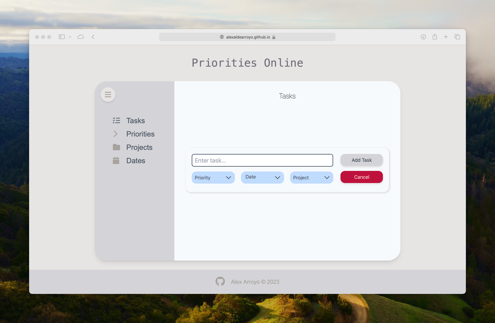

# Priorities Online

**Priorities Online** is a web-based task management application that helps you stay organized and focused. This app allows users to categorize tasks by priority, bundle them into projects, and keep track of deadlines with an integrated calendar feature. It's the perfect tool for anyone from students to professionals seeking to optimize their time and effort with a clear, priorities-driven approach.

## Live Preview

http://alexaldearroyo.github.io/priorities_online

## Features

- **Task Prioritization**: Assign high, medium, or low priorities to your tasks.
- **Project Categorization**: Group tasks into projects to maintain a clean and organized workspace.
- **Calendar Integration**: View your tasks in a calendar format to easily track deadlines and plan ahead.
- **Responsive Design**: A flexible interface that works on both desktop and mobile devices.
- **Simplicity and Speed**: A user-friendly UI that is intuitive to navigate, allowing for quick task management.

## Wishlist

- **Add Dark Mode**: Implement a dark theme to reduce eye strain and save energy on devices.
- **Amplify Calendar Functionalities**: Enhance the calendar features to include more views (weekly, monthly, agenda) and task-related operations directly from the calendar interface.

---
### Alex Arroyo © 2023
